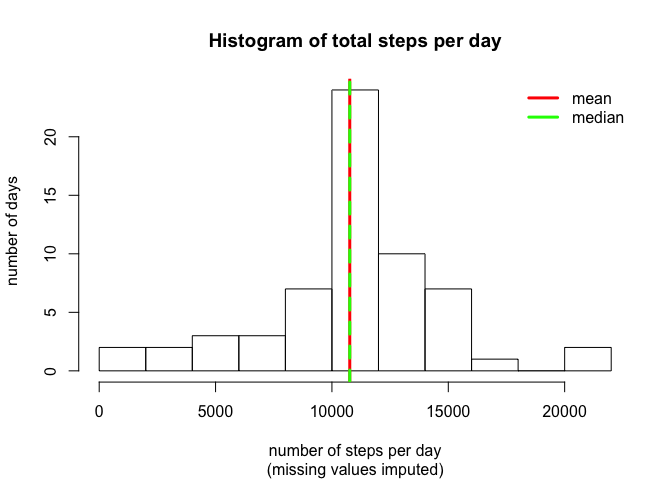
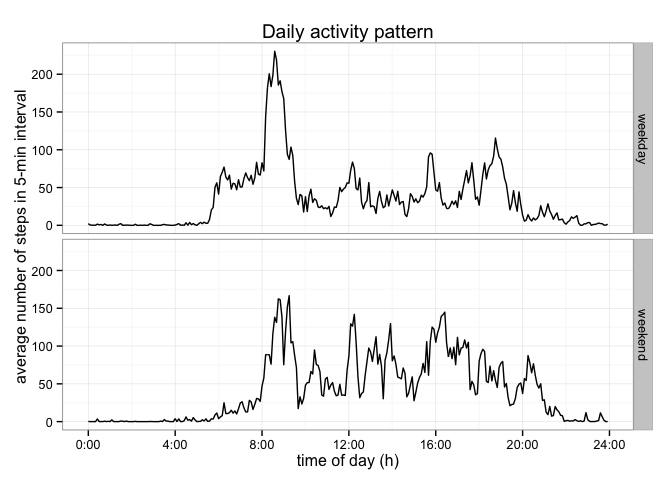

# Reproducible Research: Peer Assessment 1
###Introduction
Provided for the assignment is a CSV file (zip compressed) of readings from a subject's personal activity monitoring device. Data is collected over a 2-month period. Device records number of steps taken by the subject in every 5-minute interval throughout the day.

Variables included in this dataset are:

- *steps*: Number of steps taking in a 5-minute interval (missing values are coded as NA)

- *date*: The date on which the measurement was taken in YYYY-MM-DD format

- *interval*: Identifier for the 5-minute interval in which measurement was taken

The dataset is stored in a comma-separated-value (CSV) file and there are a total of 17,568 observations in this dataset.

###Purpose
In this assignment, we aim to explore the data for statistical values such as total number of steps per day, mean and median values, and determining daily activity pattern. We then impute the data with typical (average) values for missing values and reevaluate the data set for a better depiction of the subject's behavior pattern. We also analyze difference in activity between weekend and weekdays.

## Loading and preprocessing the data

The data file activity.csv is extracted from the compressed file `activity.zip` and then loaded into the data frame `data`. The interval data are transformed from the original format (hhmm, no digits for leading zeroes) into minutes-passed since the beginning of the day (00:00). This makes the intervals easier to work with, changing them from base 6 to base 10. The structure of the data frame and a summary statistic are displayed.


```r
data <- read.csv(unz("activity.zip", "activity.csv"), colClasses=c("integer", "Date", "integer"))

data$interval <- 60*floor((data$interval+1)/100) + (data$interval %% 100)

str(data)
```

```
## 'data.frame':	17568 obs. of  3 variables:
##  $ steps   : int  NA NA NA NA NA NA NA NA NA NA ...
##  $ date    : Date, format: "2012-10-01" "2012-10-01" ...
##  $ interval: num  0 5 10 15 20 25 30 35 40 45 ...
```

```r
summary(data)
```

```
##      steps             date               interval     
##  Min.   :  0.00   Min.   :2012-10-01   Min.   :   0.0  
##  1st Qu.:  0.00   1st Qu.:2012-10-16   1st Qu.: 358.8  
##  Median :  0.00   Median :2012-10-31   Median : 717.5  
##  Mean   : 37.38   Mean   :2012-10-31   Mean   : 717.5  
##  3rd Qu.: 12.00   3rd Qu.:2012-11-15   3rd Qu.:1076.2  
##  Max.   :806.00   Max.   :2012-11-30   Max.   :1435.0  
##  NA's   :2304
```


## What is mean total number of steps taken per day?

Total number of steps per day are summed up using the tapply function, and the their mean and median values are calculated.

```r
total_steps <- tapply(data$steps, data$date, sum, na.rm=TRUE)

#mean of total steps per day
step_mean <- mean(total_steps)
step_mean
```

```
## [1] 9354.23
```

```r
#median of total steps per day
step_median <- median(total_steps)
step_median
```

```
## [1] 10395
```

Below, total steps per day is displayed as a histogram. Mean value of the total number of steps taken per day (9354.23) is highlighted by a vertical purple line, the median (10395) by a vertical orange line. In this original dataset, the mean is a bit to the left of the median.


```r
hist(total_steps, breaks=11, xlab="number of steps per day",
     ylab="number of days",
     main="Histogram of total steps per day")
abline(v=step_mean, col="purple", lwd=3)
abline(v=step_median, col="orange", lwd=3)
legend(x="topright", legend=c("mean", "median"), col=c("purple", "orange"), bty="n", lwd=3)
```

 


## What is the average daily activity pattern?

To generate an average daily activity pattern, the mean of each 5-minute interval over each day is determined using tapply function. The activity pattern is plotted as a time series.


```r
avg_steps <- tapply(data$steps, data$interval, mean, na.rm=TRUE)

hours <- as.numeric(names(avg_steps))/60

plot(hours, avg_steps, type="l", axes=F,
     xlab="time of day (h)", ylab="average number of steps in 5-min interval",
     main="Daily activity pattern")
axis(2)
axis(1, at=0:6*4, labels=paste(0:6*4, ":00", sep=""))
```

 

Calculate the interval in which maximum number of steps occurs.


```r
#calculate index location of where max avg_steps occurs
max_activity_index <- which(avg_steps==max(avg_steps))

#Find the interval corresponding to that location of max avg_steps
max_activity_int <- data$interval[max_activity_index]

#print interval in time format hh:mm
max_activity_time <- sprintf("%02d:%02d", floor(max_activity_int/60), max_activity_int %% 60)

max_activity_time
```

```
## [1] "08:35"
```

Typically, the person is most active at 08:35, that is, 104th interval.


## Imputing missing values

The data set has 2304 rows with missing values (NAs).


```r
sum(is.na(data))
```

```
## [1] 2304
```

One strategy to impute these missing values is using the average daily activity pattern (calculated above) to transform the original dataset to replace NAs with average values for respective intervals using the transform function. For every missing value in the original data set, average number of steps in that 5-min interval will be used and a new data frame `imputedata` will be created. Consequently, instead of missing values, the new data set will contain a typical value of that 5-min interval. This method should be valid if the subject has a daily routine, that is, an activity pattern that is similar over multiple days.


```r
imputedata <- transform(data, steps=ifelse(is.na(steps), avg_steps, steps))

summary(imputedata)
```

```
##      steps             date               interval     
##  Min.   :  0.00   Min.   :2012-10-01   Min.   :   0.0  
##  1st Qu.:  0.00   1st Qu.:2012-10-16   1st Qu.: 358.8  
##  Median :  0.00   Median :2012-10-31   Median : 717.5  
##  Mean   : 37.38   Mean   :2012-10-31   Mean   : 717.5  
##  3rd Qu.: 27.00   3rd Qu.:2012-11-15   3rd Qu.:1076.2  
##  Max.   :806.00   Max.   :2012-11-30   Max.   :1435.0
```

Now, using the new data set with imputed values, total number of steps per day are again summed up using tapply function, and the mean and median are determined.


```r
total_imputesteps <- tapply(imputedata$steps, imputedata$date, sum, na.rm=TRUE)

imputestep_mean <- mean(total_imputesteps)
imputestep_mean
```

```
## [1] 10766.19
```

```r
imputestep_median <- median(total_imputesteps)
imputestep_median
```

```
## [1] 10766.19
```

The following histogram graphically shows the total number of steps, mean and median of the new dataset `imputedata`. The mean value of the total number of steps taken per day (1.0766189\times 10^{4}) is highlighted by a vertical red line, the median (1.0766189\times 10^{4}) by a vertical green line. The mean and the median overlap, and the peak of days with no recorded steps is gone. Both values have increased compared to the original data set. The increase of the mean, however, is much stronger.


```r
hist(total_imputesteps, breaks=11, xlab="number of steps per day",
     ylab="number of days",
     sub="(missing values imputed)",
     main="Histogram of total steps per day")
abline(v=imputestep_mean, col="red", lwd=3)
abline(v=imputestep_median, col="green", lwd=3, lty=2)
legend(x="topright", legend=c("mean", "median"), col=c("red", "green"), bty="n", lwd=3)
```

 


Calculate sum of total steps in original data and compare it to sum of steps after adding typical values for NAs.


```r
sum(data$steps, na.rm=T) #sum of steps in original data
```

```
## [1] 570608
```

```r
sum(imputedata$steps) #sum of steps in imputed data set after adding typical values for NAs
```

```
## [1] 656737.5
```

Due to imputation, the total sum of steps in these two months increases from 570608 to 6.5673751\times 10^{5}.


## Are there differences in activity patterns between weekdays and weekends?

In order to identify differences between weekdays and weekends, a daily activity pattern is generated for both categories. First the data is classified as recorded either on a weekday or on a weekend, and this information is stored in `week`. The data is then aggregated by 5-min interval and weekday/weekend. Using `ggplot` function, a panel plot contrasting the weekday and weekend activity is generated.


```r
week <- factor(weekdays(imputedata$date) %in% c("Saturday", "Sunday"), 
               labels=c("weekday", "weekend"), ordered=FALSE)

imputesteps <- aggregate(imputedata$steps, by=list(interval=imputedata$interval, weekday=week), mean)

library(ggplot2)
g<- ggplot(imputesteps, aes(interval/60, x))
g + geom_line() + facet_grid(weekday ~ .) + 
        scale_x_continuous(breaks=0:6*4, labels=paste(0:6*4, ":00", sep="")) +
        theme_bw() + labs(y="average number of steps in 5-min interval") +
        labs(x="time of day (h)") +
        labs(title="Daily activity pattern")
```

 

There is a distinct peak in the weekday mornings leading to higher morning activity on the weekdays. However, overall activity is higher on the weekends. Based on this differential weekday/weekend activity patterns, a more precise imputation strategy could be devised to use weekend interval averages for imputing weekend activity and weekday interval averages for imputing weekday activity. 

==================  
Created by Prachi Singh on Sat Jan 17 02:40:53 2015
